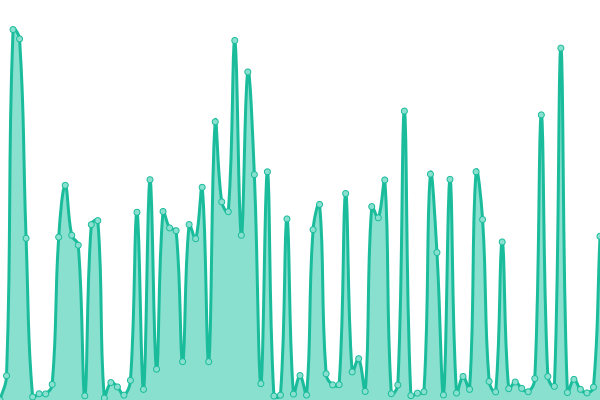

# [📈 Live Status](https://status.thermal.run.place): <!--live status--> **🟧 Partial outage**

This repository contains the open-source uptime monitor and status page for [the1ev234](https://status.thermal.run.place), powered by [Upptime](https://github.com/upptime/upptime).

With [Upptime](https://upptime.js.org), you can get your own unlimited and free uptime monitor and status page, powered entirely by a GitHub repository. We use [Issues](https://github.com/the1ev234/status-thermal/issues) as incident reports, [Actions](https://github.com/the1ev234/status-thermal/actions) as uptime monitors, and [Pages](https://status.thermal.run.place) for the status page.

<!--start: status pages-->
<!-- This summary is generated by Upptime (https://github.com/upptime/upptime) -->
<!-- Do not edit this manually, your changes will be overwritten -->
<!-- prettier-ignore -->
| URL | Status | History | Response Time | Uptime |
| --- | ------ | ------- | ------------- | ------ |
|  [Thermal](http://thermal.run.place/) | 🟩 Up | [thermal.yml](https://github.com/the1ev234/status-thermal/commits/HEAD/history/thermal.yml) | 

 3352ms
     
 | 

<a href="https://status.thermal.run.place/history/thermal">100.00%</a>
    

|  [Client Setup](http://setup.thermal.run.place/) | 🟩 Up | [client-setup.yml](https://github.com/the1ev234/status-thermal/commits/HEAD/history/client-setup.yml) | 

 3087ms
     
 | 

<a href="https://status.thermal.run.place/history/client-setup">22.23%</a>
    

|  [API](http://thermal.run.place/api/) | 🟥 Down | [api.yml](https://github.com/the1ev234/status-thermal/commits/HEAD/history/api.yml) | 

 806ms
     
 | 

<a href="https://status.thermal.run.place/history/api">0.00%</a>
    

|  [Asset Delivery](http://thermal.run.place/asset/) | 🟩 Up | [asset-delivery.yml](https://github.com/the1ev234/status-thermal/commits/HEAD/history/asset-delivery.yml) | 

 82ms
     
 | 

<a href="https://status.thermal.run.place/history/asset-delivery">100.00%</a>
    

<!--end: status pages-->

[**Visit our status website →**](https://status.thermal.run.place)

## 📄 License

- Powered by: [Upptime](https://github.com/upptime/upptime)
- Code: [MIT](./LICENSE) © [Anand Chowdhary](https://anandchowdhary.com), supported by [Pabio](https://pabio.com)
- Data in the `./history` directory: [Open Database License](https://opendatacommons.org/licenses/odbl/1-0/)
